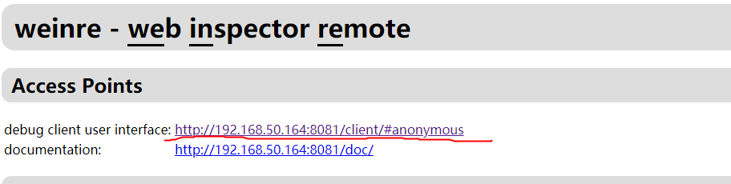
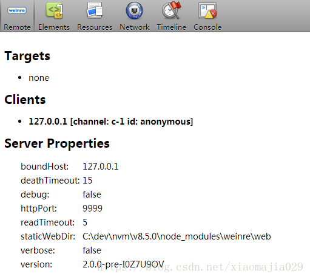
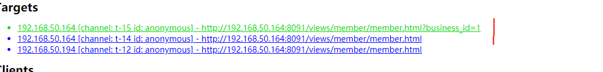
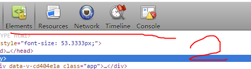

# weinre 配置
###### 主要是在手机上浏览相应的web页面，然后在PC上进行调试（Element / Network / Console等）。
## （1）weinre安装
#### npm -g install weinre 
## （2）weinre使用
#### 1、获取本机地址
```
Mac    在终端执行 ipconfig getifaddr en0 命令
Window 在命令行执行 ipconfig 命
```
####  2、启动weinre服务
```
weinre --boundHost 192.168.50.1 --httpPort 8081
 --boundHost [hostname | ip address | -all-]: 
  设置查询出来的本机id
  weinre --boundHost 192.168.50.1 --httpPort 8081
 --httpPort [portNumber]: 设置Weinre使用的端口号， 默认是8080
```
#### 3、打开PC端调试界面：

在浏览器地址栏访问刚刚设置的ip和端口号来访问weinre页面

#### 4、在需要调试的目标页面中添加一段script代码
```
  <script src="http://192.168.50.1:8081/target/target-script-min.js#anonymous"></script>
```

#### 5、进入调试页面


##### 没有链接时，调试界面展示如下：


#### 6、在移动设备上，打开相应的页面（pc和mobile在同一局域网当中），链接成功后，调试界面会变为如下界面（targets即为目标页面的地址，点击Element即可查看相应的页面元素进行调试）安卓h5混合开发上访问也是如此
点击地址变成绿色后

顶部的操作Element、console 就对应当前页面的操作
